---
tags:
  - ocr
  - pytorch
license: mit
datasets:
  - hammer888/captcha-data
metrics:
  - accuracy
  - cer
pipeline_tag: image-to-text
library_name: transformers
---

<div align="center">

# ✨ DeepCaptcha-CRNN: Sequential Vision for OCR
### CRNN Base


[](https://opensource.org/licenses/MIT)
[](https://www.python.org/downloads/release/python-3130/)
[](https://huggingface.co/Graf-J/captcha-crnn-finetuned)

🚀 **Live Demo:**  
👉 [Try the Model in Your Browser](https://huggingface.co/spaces/Graf-J/Captcha-Demo)

---

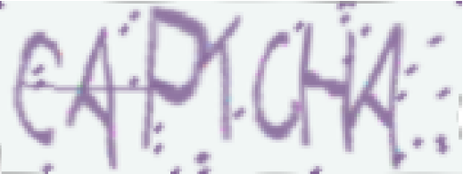

*Advanced sequence recognition using a Convolutional Recurrent Neural Network (CRNN) with Connectionist Temporal Classification (CTC) loss.*

</div>

---

## 📋 Model Details
- **Task:** Alphanumeric Captcha Recognition
- **Input:** Images
- **Output:** String sequences (Length 1–8 characters)
- **Vocabulary:** Alphanumeric (`a-z`, `A-Z`, `0-9`)
- **Architecture:** CRNN (CNN + Bi-LSTM)

---

## 📊 Performance Metrics
This project features four models exploring the trade-offs between recurrent (LSTM) and attention-based (Transformer) architectures, as well as the effects of fine-tuning on capchas generated by the [Python Captcha Library](https://captcha.lepture.com/).


| Metric | **CRNN (Base)** | **CRNN (Finetuned)** | **Conv-Transformer (Base)** | **Conv-Transformer (Finetuned)** |
|--------|-----------------|----------------------|-----------------------------|----------------------------------|
| Architecture | CRNN | CRNN | Convolutional Transformer | Convolutional Transformer |
| Training Data | [hammer888/captcha-data](https://huggingface.co/datasets/hammer888/captcha-data) | [hammer888/captcha-data](https://huggingface.co/datasets/hammer888/captcha-data) <br> [Python Captcha Library](https://captcha.lepture.com/) | [hammer888/captcha-data](https://huggingface.co/datasets/hammer888/captcha-data) | [hammer888/captcha-data](https://huggingface.co/datasets/hammer888/captcha-data) <br> [Python Captcha Library](https://captcha.lepture.com/) |
| # Parameters | **3,570,943** | **3,570,943** | 12,279,551 | 12,279,551 |
| Model Size | **14.3 MB** | **14.3 MB** | 51.7 MB | 51.7 MB |
| Sequence Accuracy <br> ([hammer888/captcha-data](https://huggingface.co/datasets/hammer888/captcha-data)) | 96.81% | 92.98% | **97.38%** | 95.36% |
| Character Error Rate (CER) <br> ([hammer888/captcha-data](https://huggingface.co/datasets/hammer888/captcha-data)) | 0.70% | 1.59% | **0.57%** | 1.03% |
| Sequence Accuracy <br> ([Python Captcha Library](https://captcha.lepture.com/)) | 9.65% | 86.20% | 11.59% | **88.42%** |
| Character Error Rate (CER) <br> ([Python Captcha Library](https://captcha.lepture.com/)) | 43.98% | 2.53% | 38.63% | **2.08%** |
| Throughput (img/sec) | 447.26 | 447.26 | **733.00** | **733.00** |
| Compute Hardware | NVIDIA RTX A6000 | NVIDIA RTX A6000 | NVIDIA RTX A6000 | NVIDIA RTX A6000 |
| Link | [Graf-J/captcha-crnn-base](https://huggingface.co/Graf-J/captcha-crnn-base) | [Graf-J/captcha-crnn-finetuned](https://huggingface.co/Graf-J/captcha-crnn-finetuned) | [Graf-J/captcha-conv-transformer-base](https://huggingface.co/Graf-J/captcha-conv-transformer-base) | [Graf-J/captcha-conv-transformer-finetuned](https://huggingface.co/Graf-J/captcha-conv-transformer-finetuned)

---

## 🧪 Try It With Sample Images

The following are images sampled of the test set of the [hammer888/captcha-data](https://huggingface.co/datasets/hammer888/captcha-data) dataset. Click any image below to download it and test the model locally.

<div align="center">
<table>
<tr>
<td><a href="https://huggingface.co/Graf-J/captcha-crnn-finetuned/resolve/main/images/46CN5W.jpg">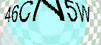</a></td>
<td><a href="https://huggingface.co/Graf-J/captcha-crnn-finetuned/resolve/main/images/5820.jpg">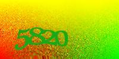</a></td>
<td><a href="https://huggingface.co/Graf-J/captcha-crnn-finetuned/resolve/main/images/6521.jpg">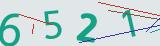</a></td>
<td><a href="https://huggingface.co/Graf-J/captcha-crnn-finetuned/resolve/main/images/abfsh.jpg">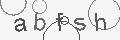</a></td>
<td><a href="https://huggingface.co/Graf-J/captcha-crnn-finetuned/resolve/main/images/67qas.jpg">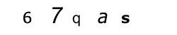</a></td>
<td><a href="https://huggingface.co/Graf-J/captcha-crnn-finetuned/resolve/main/images/75ke.jpg">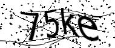</a></td>
</tr>
<tr>
<td><a href="https://huggingface.co/Graf-J/captcha-crnn-finetuned/resolve/main/images/8JKM.jpg"></a></td>
<td><a href="https://huggingface.co/Graf-J/captcha-crnn-finetuned/resolve/main/images/8jpwt0.jpg">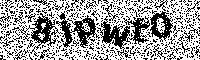</a></td>
<td><a href="https://huggingface.co/Graf-J/captcha-crnn-finetuned/resolve/main/images/B1QAZ6.jpg">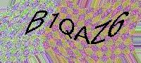</a></td>
<td><a href="https://huggingface.co/Graf-J/captcha-crnn-finetuned/resolve/main/images/CCX8.jpg"></a></td>
<td><a href="https://huggingface.co/Graf-J/captcha-crnn-finetuned/resolve/main/images/EPOD.jpg"></a></td>
<td><a href="https://huggingface.co/Graf-J/captcha-crnn-finetuned/resolve/main/images/ER6Y.jpg">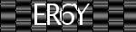</a></td>
</tr>
<tr>
<td><a href="https://huggingface.co/Graf-J/captcha-crnn-finetuned/resolve/main/images/EWSP.jpg"></a></td>
<td><a href="https://huggingface.co/Graf-J/captcha-crnn-finetuned/resolve/main/images/GIOGp.jpg">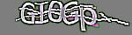</a></td>
<td><a href="https://huggingface.co/Graf-J/captcha-crnn-finetuned/resolve/main/images/HCDS.jpg"></a></td>
<td><a href="https://huggingface.co/Graf-J/captcha-crnn-finetuned/resolve/main/images/JBWkEs.jpg">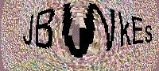</a></td>
<td><a href="https://huggingface.co/Graf-J/captcha-crnn-finetuned/resolve/main/images/kJtOfk.jpg">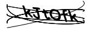</a></td>
<td><a href="https://huggingface.co/Graf-J/captcha-crnn-finetuned/resolve/main/images/MFMH.jpg"></a></td>
</tr>
<tr>
<td><a href="https://huggingface.co/Graf-J/captcha-crnn-finetuned/resolve/main/images/NJSEX.jpg"></a></td>
<td><a href="https://huggingface.co/Graf-J/captcha-crnn-finetuned/resolve/main/images/R6AB.jpg"></a></td>
<td><a href="https://huggingface.co/Graf-J/captcha-crnn-finetuned/resolve/main/images/TVHF.jpg">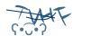</a></td>
<td><a href="https://huggingface.co/Graf-J/captcha-crnn-finetuned/resolve/main/images/Vb4cG.jpg"></a></td>
<td><a href="https://huggingface.co/Graf-J/captcha-crnn-finetuned/resolve/main/images/XaNqQx.jpg">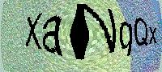</a></td>
<td><a href="https://huggingface.co/Graf-J/captcha-crnn-finetuned/resolve/main/images/YULM.jpg"></a></td>
</tr>
<tr>
<td><a href="https://huggingface.co/Graf-J/captcha-crnn-finetuned/resolve/main/images/b6yc.jpg"></a></td>
<td><a href="https://huggingface.co/Graf-J/captcha-crnn-finetuned/resolve/main/images/bCWaLR.jpg"></a></td>
<td><a href="https://huggingface.co/Graf-J/captcha-crnn-finetuned/resolve/main/images/d3no.jpg">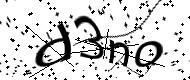</a></td>
<td><a href="https://huggingface.co/Graf-J/captcha-crnn-finetuned/resolve/main/images/3eplzv.jpg">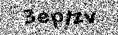</a></td>
<td><a href="https://huggingface.co/Graf-J/captcha-crnn-finetuned/resolve/main/images/iq1sZo.jpg">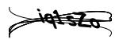</a></td>
<td><a href="https://huggingface.co/Graf-J/captcha-crnn-finetuned/resolve/main/images/KKh8Q.jpg"></a></td>
</tr>
</table>
</div>

---

## 🚀 Quick Start (Pipeline - Recommended)

The easiest way to perform inference is using the custom Hugging Face pipeline.

```python
from transformers import pipeline
from PIL import Image

# Initialize the pipeline
pipe = pipeline(
    task="captcha-recognition", 
    model="Graf-J/captcha-crnn-base", 
    trust_remote_code=True
)

# Load and predict
img = Image.open("path/to/image.png")
result = pipe(img)
print(f"Decoded Text: {result['prediction']}")

```

## 🔬 Advanced Usage (Raw Logits & Custom Decoding)

Use this method if you need access to the raw logits or internal hidden states.

```python
import torch
from PIL import Image
from transformers import AutoModel, AutoProcessor

# Load Model & Custom Processor
repo_id = "Graf-J/captcha-crnn-base"
processor = AutoProcessor.from_pretrained(repo_id, trust_remote_code=True)
model = AutoModel.from_pretrained(repo_id, trust_remote_code=True)

model.eval()

# Load and process image
img = Image.open("path/to/image.png")
inputs = processor(img) 

# Inference
with torch.no_grad():
    outputs = model(inputs["pixel_values"])
    logits = outputs.logits

# Decode the prediction via CTC logic
prediction = processor.batch_decode(logits)[0]
print(f"Prediction: '{prediction}'")

```

---

## ⚙️ Training
The base model was trained on a refined version of the [hammer888/captcha-data](https://huggingface.co/datasets/hammer888/captcha-data) (1,365,874 images). This dataset underwent a specialized cleaning process where multiple pre-trained models were used to identify and prune inconsistent data. Specifically, images where models were "confidently incorrect" regarding casing (upper/lower-case errors) were removed to ensure high-fidelity ground truth for the final training run.

### **Parameters**
- **Optimizer:** Adam (lr=0.002)
- **Scheduler:** ReduceLROnPlateau (factor=0.5, patience=3)
- **Batch Size:** 128
- **Loss Function:** CTCLoss
- **Augmentations:** ElasticTransform, Random Rotation, Grayscale Resize

---

## 🔍 Error Analysis

The following confusion matrices illustrate the character-level performance across the alphanumeric vocabulary for the test dataset of the images generated via Python.

### **Full Confusion Matrix**
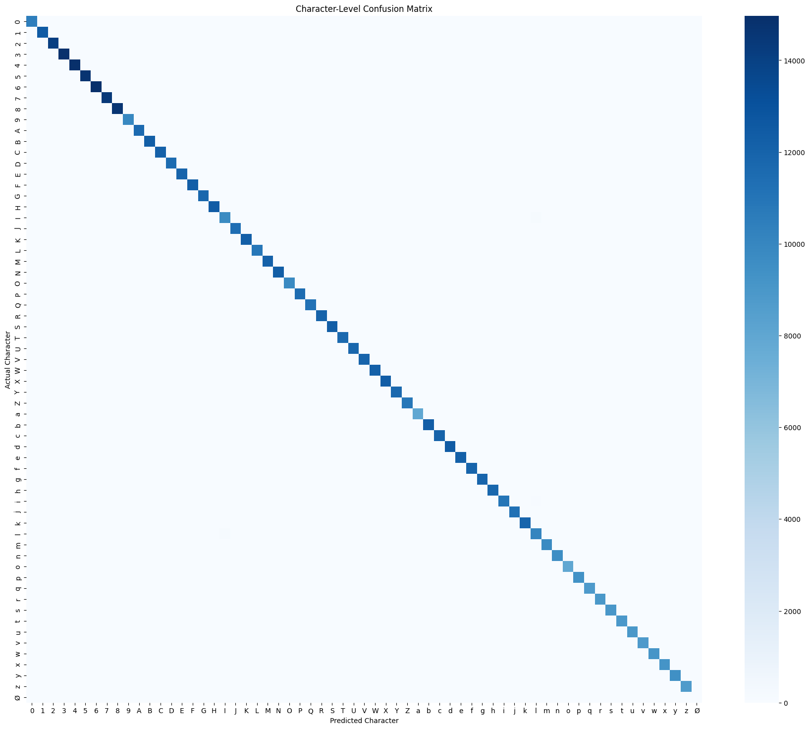

### **Misclassification Deep Dive**

This matrix highlights only the misclassification patterns, stripping away correct predictions to visualize which character pairs (such as '0' vs 'O' or '1' vs 'l') the model most frequently confuses. While the dataset underwent a specialized cleaning process to minimize noisy labels, the confusion matrix reveals a residual pattern of misclassifications between visually similar upper and lowercase characters.

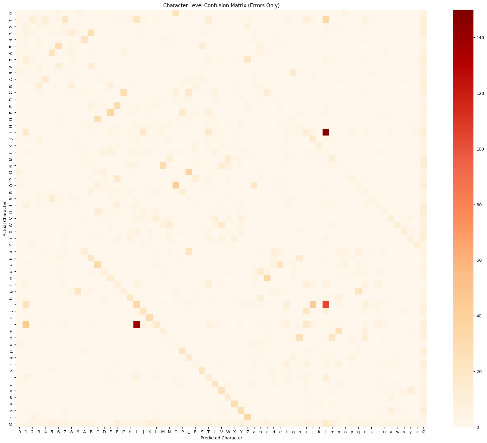
---

## ⚖️ **License & Citation**

This project is licensed under the **MIT License**. If you use this model in your research, portfolio, or applications, please attribute the author.


